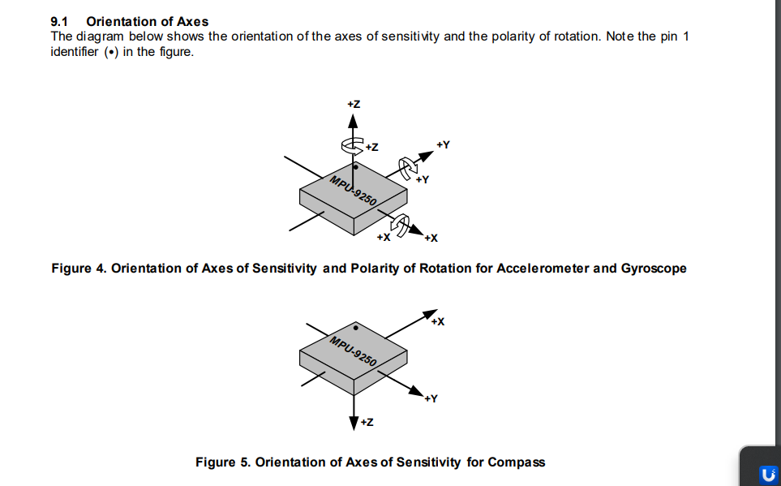

# IMUFusion

IMUFusion is an API that performs sensor fusion on IMU data to get orientation anles Roll(rotation around X), Pitch(rotation around Y) and Yaw(rotation around Z), it uses the convention XYZ for fixed axis and ZYX for the euler angles.
IMUFusion has been developed to ensure lightweightness and efficiency, it only uses the standard C/C++ libraries, with no dependencies.
The user can choose between 2 sensor fusion algorithms, the Complementary filter, and the Extended Kalman Filter.

## The frame assignment is important, the api expects that the gyroscope, accelerometer and magnetometer share the same frame assignment

## Example of usage of the complementary filter

```
#include "IMUFusion.h"


int main()
{
    // Initialize with Complementary filter
    IMUFusion::IMUFusion fusion(IMUFusion::FilterType::COMPLEMENTARY);

    //set ratio used in Complementary filter
    fusion.setAlpha(0.95f);

    // Create IMUData structure
    IMUFusion::IMUData imuData;


    // main loop
    while (1)
    {
        //the imu data is retrieved from the sensors
        // in m/s²
        imuData.accelerometer[0] = accel_x;
        imuData.accelerometer[1] = accel_y;
        imuData.accelerometer[2] = accel_z;
        // in radians/sec
        imuData.gyroscope[0] = gyro_x;
        imuData.gyroscope[1] = gyro_y;
        imuData.gyroscope[2] = gyro_z;

        float timespent = std::chrono::duration_cast<std::chrono::microseconds>(
                              std::chrono::system_clock::now().time_since_epoch())
                              .count()

        fusion.update(imuData, timestamp, false); //set hasMagnetometer = false

        float eulerAngles[3];
        fusion.getEulerAngles(eulerAngles);

    }

    return 0;
}

```

## Example of usage of the EKF

#### Pay attention to the frame assignment of the IMU you are using, the following example is for this IMU: https://wiki.seeedstudio.com/Grove-IMU_9DOF-lcm20600+AK09918/ , which has this frame assignment:



# Run

`./imu_fusion`
